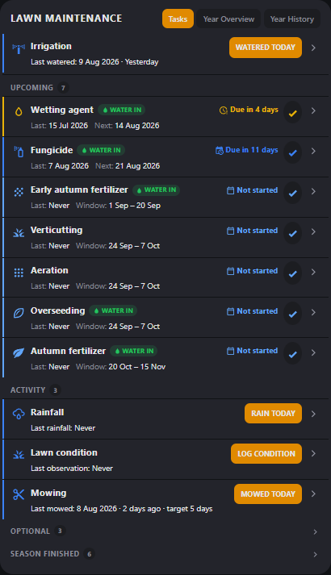
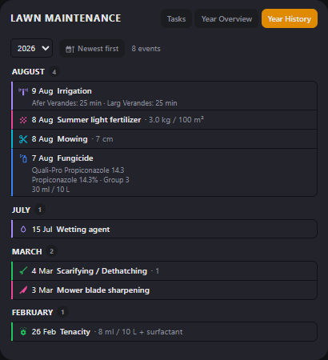
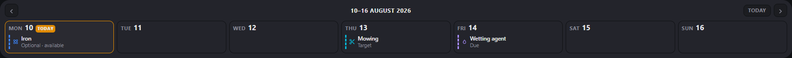

# Lawn Maintenance Card

[](https://hacs.xyz/docs/faq/custom_repositories)
[](LICENSE)

A custom [Home Assistant](https://www.home-assistant.io/) Lovelace card that
acts as a year-round lawn maintenance planner and history tracker: recurring
seasonal tasks (fungicide, fertilizer, iron, wetting agent, ...) and
once-a-year application-window tasks (Tenacity, aeration, overseeding, ...),
grouped into priority sections, with collapsible task rows, **DONE TODAY** /
**ADD APPLICATION** (backdated logging) / **SKIP THIS YEAR**, editable
history with an **UNDO**, a manual **next-due override**, and a generated
year-overview view — all driven entirely by YAML, no tasks hard-coded in the
JS.

The same JS file also provides a second, optional card,
**`custom:lawn-week-calendar`** — a read-only 7-day strip for the top of a
dashboard. It reads the same tasks and the same history as the main card and
needs no config of its own. See [Week calendar card](#week-calendar-card).

<p align="center">
  
  &nbsp;
  
</p>

<p align="center">
  <em>Tasks (left) and Year History (right) — real data from a live install.</em>
</p>



**Requirements:** Home Assistant with the
[pyscript](https://github.com/custom-components/pyscript) integration (see
[Installation](#installation)). Developed and run against Home Assistant
2026.8; it uses only long-standing frontend APIs, but older releases are
untested.

## How history is stored (read this first)

The card itself is a dependency-free `.js` file — plain custom elements, no
build step. But a Lovelace card is sandboxed frontend code; it can't write
its own files or database rows, so completion history has to live somewhere
Home Assistant already persists.

Home Assistant caps an entity's **state** string at 255 characters (a core
limit, not just a display truncation), so a plain helper like `input_text`
can't hold an unbounded JSON history blob in its state. **Entity attributes
don't have that cap.** So this card uses a small
[pyscript](https://github.com/custom-components/pyscript) backend
([`pyscript/lawn_maintenance.py`](pyscript/lawn_maintenance.py)) that stores
each task's full history and skipped-year list in the **attributes** of a
dynamically-created entity, `pyscript.lawn_<task id>`:

```yaml
state: "2026-08-08"        # most recent completion date, or "never"
attributes:
  history: ["2026-08-08", "2026-07-18", "2026-06-27", ...]   # newest first, unlimited, one entry per calendar day
  skipped_years: [2025]
  next_due_override: null   # or "2026-09-01" if manually overridden
```

- **Survives HA restarts**: pyscript entities can be marked with
  `state.persist()`, which restores their value + attributes from HA's
  restore-state storage. A small internal registry entity
  (`pyscript.lawn_registry`) remembers every task id that's ever been used,
  so a `startup` trigger re-persists all of them automatically after a
  restart — you don't need to hand-maintain a list anywhere.
- **Survives browser refresh**: the card just reads `hass.states[...]`, the
  normal way any Lovelace card reads live state.
- **No helpers to create per task.** Unlike `input_text`/`input_datetime`
  helpers, the pyscript entity for a task is created automatically the first
  time you press **DONE TODAY**, **ADD APPLICATION**, or **SKIP THIS YEAR**
  for it — nothing to set up in Settings → Helpers.
- **One history entry per calendar day per task.** History is stored as a
  set of dates, not a raw log — logging two applications on the same day
  collapses to one entry. Editing/deleting an entry works the same way
  (addressed by its date value), which is what makes those actions simple
  service calls instead of needing per-entry IDs.
- **Not localStorage.** Nothing important lives only in the browser.
- **No binary data in history.** Attached photos (see "Photo attachments")
  are stored by Home Assistant's own `image_upload` integration; the
  history entry holds only the resulting id. Entity attributes are a poor
  place for image bytes — every read pulls the whole blob into memory —
  so they never go in there.

## Installation

> **This card needs a backend.** It stores history in `pyscript.lawn_<task_id>`
> entity attributes, so [pyscript](https://github.com/custom-components/pyscript)
> and [`pyscript/lawn_maintenance.py`](pyscript/lawn_maintenance.py) are
> required. **HACS installs the dashboard file only** — the HACS "Dashboard"
> category copies `lawn-maintenance-card.js` and nothing else, so step 1 and
> step 2 below are manual either way. Without them the card loads but every
> task shows "Never" and nothing can be logged.

### Install via HACS (the card file)

HACS → ⋮ (top right) → **Custom repositories** → add
`https://github.com/ilirdokle43/HA-Lawn-Maintenance-Card` with category
**Dashboard** → then find **Lawn Maintenance Card** in HACS and install it.
HACS adds the Lovelace resource for you, so you can skip step 3.

You still need steps 1 and 2.

### 1. Install pyscript

Via HACS: HACS → Integrations → search **pyscript** → install → restart Home
Assistant → add the integration (Settings → Devices & Services → Add
Integration → pyscript). The default config (no `allow_all_imports`) is
fine — this card's backend only uses pyscript's built-in `state`/`service`
helpers, no filesystem or extra Python packages.

Minimal `configuration.yaml` entry (the config-flow install adds this for
you, but for reference):

```yaml
pyscript: {}
```

### 2. Add the backend script

Copy [`pyscript/lawn_maintenance.py`](pyscript/lawn_maintenance.py) into
`<config>/pyscript/lawn_maintenance.py`. pyscript auto-loads every `.py`
file in that folder — no further registration needed. After copying it,
reload pyscript (Developer Tools → YAML → pyscript reload, or restart HA).

### 3. Add the Lovelace card resource

*Skip this if you installed via HACS — it registers the resource for you.*

Copy [`lawn-maintenance-card.js`](lawn-maintenance-card.js) into
`<config>/www/`, then **Settings → Dashboards → ⋮ → Resources → Add
Resource**:

- URL: `/local/lawn-maintenance-card.js?v=1`
- Resource type: **JavaScript module**

**Updating a manually-installed file later?** Browsers (and HA's own PWA
service worker) aggressively cache JS module resources by URL — overwriting
`lawn-maintenance-card.js` in place is often *not* enough to see the change,
even after a hard refresh. Bump the `?v=` query string in the resource URL
(`?v=2`, `?v=3`, ...) each time you deploy an updated file. HACS installs
handle this on their own.

### 4. Add the card

Edit a dashboard in YAML mode and add a card with `type: custom:lawn-maintenance-card`
(see [`examples/example.yaml`](examples/example.yaml) for a full example with
8 starter tasks). This card doesn't ship a GUI editor — task lists are
structured/nested enough that hand-written YAML is clearer to maintain than a
form, and the whole point is that you can add, remove, and change tasks
without ever touching the JS.

### Updating

HACS offers each new GitHub release. After updating, hard-refresh the page
once (or restart the HA app) so the browser picks up the new file. If a
release also changes [`pyscript/lawn_maintenance.py`](pyscript/lawn_maintenance.py)
— the release notes will say so — copy the new backend file over yours and
reload pyscript, since HACS does not manage that file.

## Configuration

### Card-level options

| Key | Required | Description |
|---|---|---|
| `tasks` | Yes | Array of task objects (see below) |
| `title` | No | Header text, default `LAWN MAINTENANCE` |
| `show_overview` | No | Show the "Year Overview" tab, default `true` |

### Task fields (all task types)

| Key | Required | Description |
|---|---|---|
| `name` | Yes | Display name |
| `type` | Yes | `recurring`, `seasonal`, or `log` (see "Log tasks" below) |
| `id` | Recommended | Slug used for the backing entity `pyscript.lawn_<id>`. Auto-derived from `name` if omitted (lowercased, non-alphanumeric → `_`) — set it explicitly if you might rename the task later, since renaming without a fixed `id` orphans the old history under the old slug. |
| `icon` | No | `mdi:*` icon, defaults to a sensible per-type icon |
| `description` | No | Shown in the expanded detail panel |
| `product` | No | Product name, shown in detail panel. Ignored if `products` (below) is set. |
| `application_rate` | No | e.g. `"20 ml / 10 L"`, shown in detail panel |
| `products` | No | List of `{id, name, active_ingredient, group, water_in, water_in_note}` — tracks which product was used per application and suggests rotation. See "Product rotation" below. Use this *instead of* `product`/`application_rate` when you rotate between multiple products for one task. |
| `notes` | No | Free text, shown in detail panel |
| `optional` | No | `true`/`false`, default `false`. Tracked normally (history, Add Application, Done Today) but never produces an overdue/missed warning — see "Optional tasks" below. |
| `water_in` | No | `true`/`false` — purely informational, shown as a "Water in" row and in the log-application form. See "Water-in instructions" below. |
| `water_in_note` | No | Free text shown under the `water_in` row, e.g. `"Water thoroughly after application"`. |
| `advisory` | No | `{entity, below, above, duration_hours, message, clear_message}` — reads a numeric HA sensor and shows an informational recommendation, never affecting status/history. See "Sensor advisories" below. |
| `details` | No | List of `{label, value}` pairs shown verbatim in the expanded detail panel — static info, not tied to any history entry. Generic — works on any task type. |
| `entry_fields` | No | List of `{id, label, type, unit, default, min, max, step}` — records a structured value *with each history entry* (e.g. mowing height or an application rate) instead of a static display. `type` is `number` or `text`. See "Log tasks" below. Generic — works on any task type, not just `type: log`. |
| `snapshot_entities` | No | List of `{entity, label}` — captures each HA entity's live state *at the moment* a history entry is logged and freezes it into that entry permanently. See "Sensor snapshots" below. Generic — works on any task type. |
| `allow_photo` | No | `true`/`false`, default `false`. Adds an optional photo picker to the log/add form and shows a thumbnail on matching history entries. See "Photo attachments" below. Generic — works on any task type. |

### Recurring task fields (`type: recurring`)

| Key | Required | Description |
|---|---|---|
| `active_months` | Yes | Array of month numbers (`1`–`12`) the task is active in |
| `interval_days` | Yes | Repeat interval in days |
| `due_soon_days` | No | Days-before-due to switch from "Due in X days" to the "due soon" status color, default `3` |

```yaml
- id: fungicide
  name: Fungicide
  type: recurring
  active_months: [5, 6, 7, 8, 9]
  interval_days: 21
```

### Seasonal window task fields (`type: seasonal`)

| Key | Required | Description |
|---|---|---|
| `window.start` | Yes | `MM-DD`, e.g. `"02-15"` |
| `window.end` | Yes | `MM-DD`, e.g. `"03-15"`. If earlier in the year than `start`, the window is treated as wrapping into the next calendar year (e.g. a winter window `11-15` → `02-15`). |
| `upcoming_days` | No | Days-before-window-opens to switch from "Not started" to "Upcoming", default `21` |
| `ending_soon_days` | No | Days-before-window-closes to switch to "Window ending soon", default `5` |

```yaml
- id: tenacity
  name: Tenacity
  type: seasonal
  window:
    start: "02-15"
    end: "03-15"
```

### Log task fields (`type: log`)

A generic "record an event, show when it last happened, keep full history"
task — no season, no interval, never overdue. See "Log tasks" below for the
full picture.

| Key | Required | Description |
|---|---|---|
| `action_label` | No | Main quick-action button text, default `DONE TODAY` |
| `add_action_label` | No | Secondary backdated-entry button text, default `ADD ENTRY` |
| `value_label` | No | Label for the last-event line/row, default `Last logged` |
| `history_label` | No | History section heading, default `History` |
| `target_interval_days` | No | Informational-only guidance interval — never creates an overdue/Needs Attention state |
| `pinned` | No | `true` shows this task above every normal section, near the top of the card |
| `show_in_overview` | No | `true` shows the task in Year Overview's current month; default `false` (log tasks are continuous activity, not an annual window) |

```yaml
- id: mowing
  name: Mowing
  type: log
  icon: mdi:content-cut
  pinned: true
  action_label: MOWED TODAY
  add_action_label: ADD MOWING
  value_label: Last mowed
  target_interval_days: 5
  entry_fields:
    - id: height
      label: Mowing height
      type: number
      unit: cm
      default: 6
      min: 1
      max: 10
      step: 1
```

`type` is `number` (bounded, needs `min`/`max`/`step`) or `text` (free
input). With `entry_fields` configured, MOWED TODAY silently records each
field's `default` (no prompt — that's the whole point of a one-tap quick
action). ADD MOWING is a deliberate backdated entry, so it shows a control
per field instead — a bounded dropdown for `number`, a text box for `text`
— pre-filled with the `default`. Editing a history entry gets the same
per-field control to correct/override that specific entry's value.

`entry_fields` values are per-entry historical data, not a task-level
detail — they show up next to each date in history (e.g. `8 Aug 2026 — 6
cm`), never as a row in the static details panel above. That's deliberate:
a task can have both a static field describing the recommended/default
value (e.g. `application_rate`) *and* an `entry_fields` entry recording
what was actually used on each application — showing the same information
twice (once static, once per-entry) would be redundant and would blur
"the recommended value" with "what actually happened on this date". A
blank/unset `default` is simply omitted from an entry rather than storing
or displaying an empty value.

See [`examples/example.yaml`](examples/example.yaml) for a complete config
with Fungicide, Fertilizer, Iron, Wetting agent, Tenacity, Aeration,
Overseeding, Autumn fertilizer, Nitrogen boost, and Mowing (see below).

## Optional tasks

Some treatments are worth tracking but shouldn't ever nag you — e.g. a
high-nitrogen fertilizer you apply only if the lawn looks like it needs it,
not on a schedule. Set `optional: true` on any recurring or seasonal task to
get exactly that: full history/Add Application/Done Today support, but the
status is always calm, never "overdue" or "missed":

```yaml
- id: nitrogen_boost
  name: Nitrogen boost
  type: seasonal
  optional: true
  window:
    start: "03-01"
    end: "05-31"
  product: "34-0-0"
```

| Task type | Situation | Status shown |
|---|---|---|
| Seasonal | Before the window | `Optional · starts <date>` |
| Seasonal | Inside the window | `Optional · available now` |
| Seasonal | Window passed, not completed/skipped | `Optional · season finished` |
| Recurring | Never completed, in season | `Optional · available now` |
| Recurring | Completed, interval not yet elapsed | `Optional · next in N days` |
| Recurring | Completed, interval elapsed | `Optional · available again` |
| Recurring (either) | Outside `active_months` | `Optional · inactive` |
| Either | Completed / skipped | Unchanged (`Completed for <year>` / `Skipped for <year>`) |

Implementation-wise, `computeRecurringStatus`/`computeSeasonalStatus` run
completely unchanged for the date math (next due date, window occurrence,
override handling, ...); a separate `applyOptionalRemap()` step then relabels
the result for display when `task.optional` is true. This is also what
guarantees an optional task can never end up in **Needs attention**: its
section is forced to **Optional** regardless of the computed status, as a
second, independent safeguard beyond the relabeling itself.

Optional tasks get a small `OPTIONAL` badge next to their name (in both the
task list and Year Overview) and their own **Optional** section — after
**Upcoming**, before **Season finished**/**Inactive** — collapsed by default
like those other low-priority sections. **DONE TODAY**, **ADD APPLICATION**,
**SKIP THIS YEAR**, history editing, and (for recurring tasks) the next-due
override all work exactly the same as on any other task.

## Task rows

Each task row is collapsed by default, showing only its icon, name, current
status, last completed date, and next due date (or seasonal window, and only
when there's an actual date worth showing — see "Recurring task statuses"
below) — enough to scan the whole card in a couple of seconds. A small
checkmark on the row itself logs **DONE TODAY** without expanding it — the
row only expands when you tap the name/status area, and the checkmark stops
that click from also triggering an expand.

Tapping a row expands it to show interval/active months/window,
product/rate/notes, the full history, and the action buttons (DONE TODAY,
ADD APPLICATION, SKIP THIS YEAR, next-due override). Only one task expands at
a time — expanding another row collapses whichever one was open.

## How DONE TODAY / ADD APPLICATION work

Both call the same service, `pyscript.lawn_log_task` — **DONE TODAY** always
sends today's date; **ADD APPLICATION** (in the expanded row) opens a date
picker so you can log an application you forgot to record on the day it
actually happened. Either way, the service:

1. Adds the date to that task's `history` attribute (no duplicate if that
   day is already logged).
2. Re-sorts `history` newest-first and updates the entity's `state` to
   whichever date is now most recent — so a backdated ADD APPLICATION entry
   only becomes "last completed" if it's actually the newest one on file.
3. For **recurring** tasks, the next due date is then simply recomputed
   client-side as `last completed + interval_days` — nothing extra to store.
4. For **seasonal** tasks, the card checks whether the logged date falls near
   the current window occurrence to decide whether it counts as "completed
   this year" — nothing extra to store there either.

After **DONE TODAY**, a small "Logged `<task>` for today · UNDO" banner
appears at the top of the card for ~8 seconds — clicking it deletes that
history entry again. If you miss the window, the same correction is always
available from the history list itself (see below).

## How history works

A task's expanded detail panel shows a scrollable list of **every** logged
completion date, newest first — there's no cap. This comes straight from the
`history` attribute on the task's `pyscript.lawn_<id>` entity (inspectable
directly in Developer Tools → States). Each entry has:

- **Edit** (pencil icon) — opens a date picker for that entry; calls
  `pyscript.lawn_edit_history_entry` with the old and new date on save.
- **Delete** (trash icon) — asks for confirmation, then calls
  `pyscript.lawn_delete_history_entry`. If the entry has an attached photo
  (see "Photo attachments"), the image is deleted too, after the history
  deletion succeeds.

Because "last completed" and "next due" are always *derived* from
`history[0]` rather than stored separately, editing or deleting the most
recent entry automatically recalculates both — there's no separate value
that could get out of sync.

## Product rotation

For a task that alternates between multiple products — the classic case
being fungicide, where reusing the same mode of action repeatedly encourages
resistance — configure `products` instead of `product`/`application_rate`:

```yaml
- id: fungicide
  name: Fungicide
  type: recurring
  active_months: [5, 6, 7, 8, 9]
  interval_days: 21
  products:
    - id: propiconazole
      name: "Quali-Pro Propiconazole 14.3"
      active_ingredient: "Propiconazole 14.3%"
      group: 3
    - id: azoxystrobin
      name: "Azoxy 2SC Select"
      active_ingredient: "Azoxystrobin 22.9%"
      group: 11
```

`group` is just a label — a FRAC code, a plain number, anything you use to
identify "same mode of action." When a task has `products` configured:

- **DONE TODAY** and **ADD APPLICATION** merge into a single **LOG
  APPLICATION** button, since logging always means picking a product. The
  form adds a product dropdown next to the date, pre-selected to the
  suggestion described below. The collapsed row's quick-done checkmark opens
  this same form instead of instant-logging, for the same reason.
- The expanded panel shows **Last product used** (from the most recent
  history entry that has one) and **Suggested next** — the first configured
  product whose `group` differs from the last one used, so it naturally
  alternates rather than repeating. This is a simple "don't repeat the same
  group back-to-back" rule, not a full resistance-management planner.
- Each history entry remembers which product was used (`8 Aug 2026 — Azoxy
  2SC Select`), and editing an entry's date preserves its product.

**Storage**: a history entry becomes `{"date": "...", "product_id": "..."}`
instead of a plain date string when a product is selected — entirely
backward compatible. Entries logged before you added `products:` (or logged
via ADD APPLICATION with "No product recorded") stay plain date strings and
display/recalculate exactly as before; both shapes freely coexist in the
same task's history, deduped by date the same way regardless of shape.

## Water-in instructions

`water_in` (`true`/`false`) and `water_in_note` are purely informational —
they never affect status, history, or persistence. Set them at task level,
per-product (inside `products:`), or both:

```yaml
- id: fertilizer_example
  name: Fertilizer
  type: seasonal
  window: { start: "03-15", end: "04-15" }
  product: "12-12-17"
  water_in: true
  water_in_note: "Water thoroughly after application"

- id: fungicide_example
  name: Fungicide
  type: recurring
  active_months: [5, 6, 7, 8, 9]
  interval_days: 21
  products:
    - id: product_a
      name: "Example Product A"
      group: 3
      water_in: false
      water_in_note: "Allow treatment to dry on foliage"
```

A product's own `water_in`/`water_in_note` override the task's, resolved
independently per field (a product can override just one and inherit the
other):

```
selected product's water_in  →  task's water_in  →  not configured
```

Where it shows up:

- **Expanded details** — a "Water in" row (Yes/No + the note, if any),
  using whichever product `products:` currently suggests for a
  multi-product task, or just the task-level value otherwise.
- **Log-application form** — the same Yes/No + note for whichever product
  is *actually selected* in the dropdown, updating live as you change the
  selection. Informational only — it never blocks logging the application.
- **Collapsed row** — a small `Water in` / `No water-in` badge, only when
  `water_in` is configured somewhere for that task (nothing shown otherwise).

Tasks that don't set `water_in` anywhere behave exactly as before — no row,
no badge, no hint. Year Overview is intentionally left alone; water-in
instructions only appear in task details and the log-application form.

## Sensor advisories

`advisory` reads any numeric Home Assistant sensor and shows a subtle,
informational recommendation in the expanded task — never an automatic
command, and never something that changes status, section, or history. It
works with any numeric sensor (soil moisture, temperature, humidity, rain,
salinity, conductivity, ...) — nothing about it is specific to any one
measurement:

```yaml
- id: summer_light_fertilizer
  name: Summer light fertilizer
  type: recurring
  optional: true
  active_months: [6, 7, 8]
  interval_days: 30
  product: "12-12-17"
  advisory:
    entity: sensor.lawn_conductivity
    below: 200
    duration_hours: 48
    message: "Consider light feeding"
    clear_message: "EC level is currently acceptable"
```

| Key | Required | Description |
|---|---|---|
| `entity` | Yes | A Home Assistant entity id, e.g. `sensor.lawn_conductivity` |
| `below` / `above` | One of the two | Numeric threshold. Exactly one operator is used — if both are set, `below` wins. |
| `duration_hours` | No | If set, the condition must have held continuously for this many hours (checked against HA's own recorder history) before the advisory activates. If omitted, only the current reading is evaluated. |
| `message` | Yes | Shown when the advisory is active |
| `clear_message` | No | If set, shown (instead of nothing) when the advisory is configured but not currently active |

**Duration checks are HA-native, not client-side guesswork.** When
`duration_hours` is set, the card asks Home Assistant's own history API
(`history/period`) whether the sensor's state has satisfied the condition
for the whole window, rather than reconstructing it from scratch in the
browser or persisting anything in localStorage. This needs the `recorder`
integration enabled (on by default) with retention covering
`duration_hours` — if there's no history for the window yet (e.g. a brand
new entity), the advisory conservatively stays inactive rather than
guessing.

An advisory **never affects status, sorting, or Needs Attention** — an
optional task with an active advisory stays exactly where it already was
(e.g. in Optional), it just gains an extra informational block. Works
identically on non-optional tasks, single- and multi-product tasks, and
alongside `water_in`.

Where it shows up:

- **Expanded details only** — an "Advisory" row with the sensor's friendly
  name, current value + unit (read from the sensor's own
  `unit_of_measurement`, never hard-coded), the trigger condition, and the
  message. Styled as calm, informational blue — never the red/orange used
  for overdue/warning states.
- **Collapsed row** — nothing. Advisories are deliberately left off the
  collapsed row to keep it compact.

If the advisory is inactive, the row is omitted entirely unless
`clear_message` is set, in which case it shows the sensor reading plus the
clear message instead. Unavailable/unknown/non-numeric sensor states are
handled gracefully (shown as e.g. "Unavailable" / "Non-numeric (...)"
instead of breaking anything). Tasks that don't set `advisory` behave
exactly as before — nothing shown anywhere, no extra API calls. Year
Overview is intentionally left alone.

## Sensor snapshots

`snapshot_entities` captures one or more Home Assistant entities' *current*
state at the exact moment DONE TODAY / ADD APPLICATION is pressed, and
freezes those readings into that specific history entry permanently. This
is different from `advisory` above in a fundamental way: an advisory always
re-reads the sensor live, so it reflects *today's* value even for a task
expanded weeks later; a snapshot is captured once and never re-read — it's
what the sensor said *when you logged the application*, and keeps showing
that value even after the sensor has since moved on. Generic — works with
any entity, not just numeric sensors, and any task type:

```yaml
- id: summer_light_fertilizer
  name: Summer light fertilizer
  type: recurring
  optional: true
  active_months: [6, 7, 8]
  interval_days: 30
  product: "12-12-17"
  advisory:
    entity: sensor.lawn_conductivity
    below: 200
    duration_hours: 48
    message: "Consider light feeding"
    clear_message: "EC level is currently acceptable"
  snapshot_entities:
    - entity: sensor.lawn_conductivity
      label: Soil EC
```

The same entity can back both `advisory` (live) and `snapshot_entities`
(historical) at once, as above — they're independent, unrelated features
that happen to read the same sensor for different purposes.

| Key | Required | Description |
|---|---|---|
| `entity` | Yes | A Home Assistant entity id, e.g. `sensor.lawn_conductivity` |
| `label` | No | Shown next to the value in history; falls back to the entity id if omitted |

**Where it shows up:** compactly in history, on its own line under the
date (and any `fields`), e.g. `9 Aug 2026 — 1.0 kg / 100 m²` then `Soil EC:
290 µS/cm` underneath. Multiple entities are joined on that one line with
` · ` rather than stacking a line each, to keep history from getting
noisy. Never shown as a static row in the expanded details panel — that
would just duplicate the live Advisory row with a second, differently-timed
number next to it.

**Capture behavior:** DONE TODAY captures silently, same as `entry_fields`
defaults — no prompt. ADD APPLICATION also captures live (there is no
historical sensor lookup — the value stored is always "whatever the sensor
reads right now", even for a backdated application date), and additionally
stores a `captured_at` timestamp alongside the entry's `date` so a future
Year History view can tell the two apart if it needs to. Editing an
entry's date does **not** re-capture or touch its stored snapshot — the
snapshot is what was true when you originally logged it, and stays that
way regardless of later date corrections. Deleting an entry deletes its
snapshot with it, same as everything else on that entry.

**Missing/unavailable entities never block logging.** If an entity is
missing, `unavailable`, or `unknown` at the moment of capture, that one
snapshot is silently omitted from the entry rather than storing a
misleading placeholder value — the application still logs normally either
way. A configured entity with no `unit_of_measurement` just shows the bare
value with no unit suffix.

## Photo attachments

`allow_photo: true` adds an optional photo picker to a task's log/add form.
Generic — works on any task type, not just `type: log`.

```yaml
- id: lawn_condition
  name: Lawn condition
  type: log
  icon: mdi:grass
  action_label: LOG CONDITION
  add_action_label: ADD CONDITION
  value_label: Last observation
  history_label: Lawn condition history
  show_in_overview: false
  allow_photo: true
  entry_fields:
    - id: condition
      label: Condition
      type: text
      default: Good
  description: Record the overall condition of the lawn.
```

**The photo is always optional** — you can log an entry without one, and
tasks without `allow_photo` behave exactly as before (no picker, no
thumbnail, no change to the quick action).

**The quick action opens the form instead of instant-logging.** Because
picking a photo needs user interaction, an `allow_photo` task's main
button (e.g. LOG CONDITION) opens the log form pre-filled with today's date
and each `entry_fields` default, rather than logging immediately. Tasks
without `allow_photo` keep the original one-tap behavior.

**The browser resizes before uploading.** The picked image is scaled down
(never up) to a max long edge of 1800 px preserving aspect ratio, then
re-encoded as JPEG at ~0.82 quality — a 12 MP phone photo typically lands
around 100–200 KB. The full-size original is never uploaded. Resizing goes
through `` + canvas, which applies the browser's own EXIF-orientation
handling, so no image library is needed.

**Storage.** Uploads go to Home Assistant's own built-in `image_upload`
integration (`POST /api/image/upload`) — no extra integration or add-on to
install, and the files live under `/config/.storage/image/`, so they're
included in standard HA backups. **Image bytes never pass through pyscript
or the lawn history**: the history entry stores only the returned id, as a
generic `media` list:

```json
{
  "date": "2026-08-10",
  "fields": { "condition": "Good" },
  "media": [{ "id": "<image-upload-uuid>", "type": "image" }]
}
```

The v1 UI attaches at most one photo per entry, but the schema is an array
so multi-photo support can be added later with no migration. Entries with
no `media` key (i.e. every entry logged before this feature, and every
entry on a task without `allow_photo`) keep working unchanged.

**Display.** History rows in both the Tasks tab and Year History show a
small thumbnail, served from `/api/image/serve/<id>/256x256` and scaled
down with CSS. That endpoint only supports two fixed sizes (`256x256` and
`512x512`) — arbitrary dimensions return HTTP 400, so the card never
requests them. Tapping a thumbnail opens a simple in-card lightbox loading
`/api/image/serve/<id>/original`; close it with the ✕, by tapping the
backdrop, or with Esc. If an image is missing or fails to load, its
thumbnail just hides itself and the rest of the entry stays readable.

**Failure handling.** The upload happens *before* the history entry is
written, and the entry is only created once the upload succeeds — a failed
upload leaves the form open with your date/condition/photo selection intact
so you can retry, and never creates an entry claiming a photo that isn't
there. If the upload succeeds but the history write then fails, the
just-uploaded image is deleted again on a best-effort basis rather than
being left orphaned.

**Editing** an entry (date or field values) always preserves its existing
photo — it is never re-uploaded, replaced, or dropped. There is
deliberately no add/remove/replace-photo control in the edit form yet.

**Deleting** a history entry also deletes its attached image. The card
reads the entry's media ids first, deletes the history entry, and only
then removes the images — so a failed history delete never strands a
still-referenced photo. Image deletion uses the authenticated WebSocket
command `image/delete` (there is no REST `DELETE /api/image/<id>`
endpoint), issued from the card over the same connection everything else
uses.

> **Security note — image URLs are not authentication-protected.**
> `GET /api/image/serve/<id>/...` serves the image to anyone who requests
> that exact URL, with or without a Home Assistant login — the same as
> anything under `/local/`. The ids are random UUIDs and so are impractical
> to guess, but treat the URLs themselves as the only thing standing
> between a photo and whoever has the link, especially if your HA instance
> is reachable from the internet. Do not assume these photos are private.

## Next due override

Recurring tasks show an **Override next due date** link in their expanded
panel. Setting a date calls `pyscript.lawn_set_next_due_override`, which
takes over the next-due calculation completely (`next_due` = the override,
not `last_completed + interval_days`) until you clear it. While active:

- The collapsed row's "Next" line gets a `(manual)` tag.
- The expanded panel shows *"Next due manually set — auto would be `<date>`"*
  plus a **Return to automatic schedule** button, which calls
  `pyscript.lawn_clear_next_due_override` and goes back to the normal
  interval-based calculation.

Overdue/due-today/due-soon/upcoming status is still computed normally against
whichever date — automatic or overridden — is currently in effect.

## Lockouts (establishment periods)

Some jobs make the lawn untouchable for a while afterwards. Overseed it and
for roughly the next month you must not fertilize, spray or even mow — the
seedbed is still knitting in. A task declares that with `lockout:`, and from
the day it is logged until `days` later, everything else in scope stops asking
to be done.

```yaml
- id: overseeding
  name: Overseeding
  type: seasonal
  window: { start: "09-24", end: "10-07" }
  lockout:
    days: 30
    label: Overseeding
```

| Key | Default | Meaning |
|---|---|---|
| `days` | — (required) | How long the period lasts, counted from the logged date, which is day 1. |
| `scope` | `category` | `category` (the source task's own category), `all`, or a list of task ids. |
| `exempt` | — | Task ids that carry on as normal. |
| `label` | the task's name | Wording for the hold text and the daily marker. |

`lockout_days: 30` is shorthand for `lockout: {days: 30}`.

### What it does and does not do

This split is the whole design:

- **Predictions are suppressed.** Due, overdue, "available now", a seasonal
  window opening, a programme's next target, and a log task's
  `target_interval_days` nudge all go quiet. Held tasks move into an **On
  hold** section (collapsed by default) reading *"On hold · Overseeding day 4
  of 30 · until 29 Oct"*, and stop drawing markers on the week calendar.
- **History is never touched, and logging never stops.** Every held task keeps
  its row and stays fully loggable, and anything you actually do still shows
  as done. That is deliberate: irrigation and lawn-condition logging are
  exactly what you carry on doing during establishment, and a completed task
  is a fact, not a prediction.

A lockout never silences the task that started it, and never reaches outside
its scope — overseeding the lawn says nothing about when the AC filter is due.

### Seeing where you are

The task running the lockout paints a **"Day N of M"** marker on *every* day
of the period in the week calendar. It is the one deliberate exception to the
calendar's "at most one upcoming marker per task per week" rule: without it an
establishment period would read as an absence — an oddly empty strip — instead
of a countdown you can follow.

### Log tasks are a special case

A `type: log` task has no due/overdue concept to suppress, so it keeps its row,
its section and its pin. Only two things change: a `target_interval_days` nudge
stops printing "may be due" and says what is actually happening instead, and
its target stops appearing on the calendar. Log tasks without a target — the
usual case for irrigation, rainfall and lawn condition — are completely
unaffected, because they never predicted anything in the first place.

### Ending a hold early

Set a `lockout_until` field (a `YYYY-MM-DD` date) on the logged entry and it
overrides `days`. This rides on the per-entry `fields` that
`pyscript.lawn_edit_history_entry` already stores, so no backend change is
needed — see [How history is stored](#how-history-is-stored-read-this-first).

Only the **most recent** entry of a lockout task can be running one, so last
year's overseeding never re-arms this year's.

## How seasonal windows work

A seasonal task has one recommended application window per year
(`window.start` → `window.end`). The card determines the *current window
occurrence* (this year's, or last year's if it wraps into the current date,
or next year's if this year's has already fully passed) and derives a status:

- **Not started** — window opens more than `upcoming_days` away
- **Upcoming** — window opens within `upcoming_days`
- **Application window open** — today is inside the window
- **Window ending soon** — inside the window, ≤ `ending_soon_days` left
- **Completed this year** — a history entry falls near this occurrence
- **Skipped this year** — you pressed SKIP THIS YEAR for this occurrence
- **Missed window** — the window fully closed with no completion or skip

**SKIP THIS YEAR** calls `pyscript.lawn_skip_year` with the occurrence's
year, so the task stops showing as overdue/missed for that year and instead
shows "Skipped for `<year>`" until the next window occurrence comes around.

## Log tasks

`type: log` is for anything you just want to record and see "when did I
last do this" for — no season, no interval, never overdue. The first use
case is mowing, but nothing about the implementation is mowing-specific:
`value_label`, `action_label`, and `task.name` carry all the wording, so
blade sharpening, a soil test, or a sprinkler inspection get identical
behavior for free just by configuring a new `type: log` task.

- **Collapsed row** — a prominent quick-action button (`action_label`,
  default `DONE TODAY`) sits directly on the row, no need to expand first.
  Clicking it instantly logs today's date — it never also expands/collapses
  the row and never opens a form. Next to it, the row shows
  `<value_label>: <date> · <relative time>` — `Today` / `Yesterday` / `N
  days ago`, or `Never` if nothing's logged yet.
- **Expanded details** — last event date, days since, and (if
  `target_interval_days` is set) an "About every N days" line that
  switches to *"`<task name>` may be due"* once that many days have passed
  — informational only, never red/orange, never Needs Attention. Two
  buttons: the main action again, and a secondary backdated-entry button
  (`add_action_label`, default `ADD ENTRY`) using the exact same date-entry
  UI as ADD APPLICATION.
- **History** — full history, same edit/delete UI as every other task type.
  Editing or deleting the most recent entry correctly recalculates the
  last-event date and days-since immediately, no refresh needed.
- **Static custom fields** — `details: [{label, value}, ...]` renders
  arbitrary extra rows verbatim; it works on any task type, not just log
  tasks.
- **Per-entry custom fields** — `entry_fields: [{id, label, type, unit,
  default, min, max, step}, ...]` records a structured value *with each
  history entry* instead of a static display (e.g. mowing height, or an
  application rate alongside a task's static `application_rate`). `type` is
  `number` (bounded dropdown) or `text` (free input). MOWED TODAY silently
  uses each field's `default` — no prompt on the one-tap quick action —
  while ADD MOWING (a deliberate backdated entry) and the history edit form
  both get a control per field to set/correct that entry's value. Shown
  only in history (e.g. `8 Aug 2026 — 6 cm`), never duplicated as a static
  details row. Also works on any task type, not just log tasks.
- **Placement** — `pinned: true` shows the task above every normal section,
  right under the card title, for something you want to see at a glance.
  Without it, log tasks land in their own **Activity** section like any
  other task type would in its own section.
- **Year Overview** — log tasks are excluded by default (`show_in_overview:
  false`) since they're continuous activity, not an annual window. Setting
  it to `true` shows the task in the current month only.
- `optional` doesn't apply to log tasks — they have no overdue concept for
  it to soften in the first place.

Write/refresh mechanics are the same as every other task type: the same
`pyscript.lawn_log_task` / `lawn_edit_history_entry` /
`lawn_delete_history_entry` services, keyed only by `id`, going through the
same post-write refresh path (see "How DONE TODAY / ADD APPLICATION work")
— nothing log-specific was added to storage or the write path at all.

## Week calendar card

`custom:lawn-week-calendar` is a second card registered by the same JS file
(one resource, two cards). It shows one calendar week, Monday to Sunday: what
was actually logged up to and including today, and what is coming up for the
rest of the week.


```yaml
type: custom:lawn-week-calendar
```

That is the entire config. It deliberately has no `tasks:` of its own — it
reads the task list straight out of your existing `lawn-maintenance-card`, so
there is only ever one copy of the YAML to maintain.

### How it finds your tasks

On first render the card asks Home Assistant for the configuration of the
dashboard it is displayed on (the same `lovelace/config` call the frontend
itself uses), finds the first `custom:lawn-maintenance-card` in it, and uses
that card's `tasks:` list. History comes from the same `pyscript.lawn_<id>`
entities the main card reads. No second task list, no second history store,
no backend changes.

If you edit the dashboard, the week card re-reads the task list on its own —
the two cards can't drift apart.

| Option | Default | Purpose |
| --- | --- | --- |
| `title` | *(none)* | Optional heading above the strip. |
| `source_dashboard` | current dashboard | Only needed if your `lawn-maintenance-card` lives on a **different** dashboard — set it to that dashboard's URL path (e.g. `my-dashboard`). |
| `tasks` | *(discovered)* | Escape hatch for a standalone install with no maintenance card anywhere. Same schema as the main card. Setting this opts out of discovery, and you are then maintaining two copies of the task list. |

If the card can't find a maintenance card it says so in place, naming the
three ways to fix it, rather than rendering an empty week.

### What appears on each day

**Up to and including today — recorded history only.** An event is shown
because a history entry with that exact date exists, never because a schedule
says something should have happened. If irrigation wasn't logged, no
irrigation appears. Each event shows the task name plus one short line: the
product recorded with that entry if there was one, otherwise its recorded
`entry_fields` values (a single field renders as `7 cm`; several fields
sharing a unit collapse to `25 / 25 min`). Sensor snapshots and photo
thumbnails are deliberately left out to keep the strip compact — both remain
in Tasks and Year History.

Note that a past event is described **only** from what that entry actually
stored. A `product:` string in your current YAML is never printed under an
old entry, because that would be describing history from today's config.

**After today — upcoming, at most one marker per task per week**, all derived
from the same status engine the main card uses (there is no second scheduler):

| Situation | Shown as |
| --- | --- |
| Recurring task with a next-due date later this week | `Due` |
| Recurring task due today / overdue / never done in season | `Due today` / `Overdue` / `Recommended`, on today |
| Seasonal task whose window opens later this week | `Window starts`, on the start date |
| Seasonal task whose window is open now | `Available now`, on today only |
| Log task with `target_interval_days` and a previous entry | `Target`, on last + interval |
| Any of the above on an `optional:` task | `Optional`, `Optional · available`, `Optional · window starts` |

A two-week seasonal window is never painted across every one of its days, an
optional task that is merely inactive is not shown at all, and a task that has
never been logged never gets an invented target date. Planned events use a
dashed accent line, recorded ones a solid line.

Event colors are the same stable per-task identity colors as Year History, so
a day's colors never change as a task later becomes due or overdue.

### Layout

The strip sizes itself against the **card's** width, not the browser window,
so it behaves correctly in a narrow dashboard column on a big screen:

| Card width | Result |
| --- | --- |
| ~790 px and up | All 7 days visible at once, no scrolling |
| ~560–790 px | 3–6 days visible, scrolls horizontally |
| under ~560 px | About 2 days visible, swipe for the rest |

Scrolling is native (finger swipe, trackpad, scroll snap) with no drag
library, the scrollbar is hidden without disabling scrolling, and a swipe past
the end can't scroll the page sideways. On a narrow card showing the current
week, the strip starts scrolled so **today** is in view rather than always
starting at Monday.

Because HA's sections view lays cards out in ~400 px columns, put the card in
a section with a wider `column_span` (or a panel/masonry view) if you want all
7 days at once on desktop.

Today is marked three ways — accent border, subtle tint, and the word
`Today` — so it never depends on color alone. Arrows and **Today** are real
buttons with aria-labels.

### Scope

Version 1 is strictly read-only: no logging, editing, deleting, completion
buttons or drag-and-drop. Clicking an event does nothing. Use the main card
for anything that writes.

The selected week survives live entity updates — a state change while you are
looking at last week will not snap you back to the current week. **Today**
returns explicitly.

## How to add a new lawn task

No JS or Python changes needed — add a new entry to the `tasks:` array in
the card's YAML config (recurring or seasonal, per the field tables above)
and save the dashboard. The very first **DONE TODAY** / **ADD APPLICATION** /
**SKIP THIS YEAR** press for that task creates its backing entity
automatically.

## Recurring task statuses

A recurring task's status is never computed from the interval alone — the
configured `active_months` always take priority, so a task can't drift into
an ever-growing "overdue by 90 days" while its season is inactive:

- **Recommended now** — never completed, and currently inside an active
  month. Deliberately distinct from *Due today* (there's no real calculated
  due date to have arrived at yet, just "this would be a good time to
  start").
- **Overdue / Due today / Due soon / Due in N days** — a real calculated (or
  manually overridden) due date, computed only while that date's month is
  itself active.
- **Inactive · resumes `<Month>`** — shown whenever *either* today's month
  isn't active, *or* the calculated/overridden due date would fall in a
  month that isn't active (e.g. a spring+fall task with a summer gap: last
  completed in June, 30-day interval lands the math in July, but July isn't
  in `active_months` — the card suspends the recommendation and points at
  the next active month instead of showing a false due date). The year is
  only appended (`resumes January 2027`) when the resume month falls in a
  different calendar year than today.
- No "Next" line is shown at all when there's no real due date to display —
  never completed with nothing recommended yet, or a date currently
  suspended by the season check above.

A manual **next-due override** (see below) is checked against the same
season rule — an override that lands in an inactive month also shows as
suspended, but the override itself, and its "return to automatic" control,
stay fully visible and usable in the expanded panel regardless.

## Sorting

Tasks are grouped into five priority sections, in this order, and only
non-empty sections are shown. **Optional**, **Season finished**, and
**Inactive** are collapsed by default (tap the section header, which shows a
task count, to expand); **Needs attention** and **Upcoming** are always
shown open.

| Section | Contains |
|---|---|
| **Needs attention** | Overdue / due-today / recommended-now recurring tasks, and seasonal tasks currently inside their application window (including "ending soon") — never includes optional tasks |
| **Upcoming** | Recurring tasks due soon or further out, seasonal tasks whose window opens soon or is still a while off |
| **Optional** | Every `optional: true` task, regardless of its individual status (available/starts/season finished/completed/skipped) |
| **Season finished** | Non-optional seasonal tasks whose window passed without an application, plus tasks already completed/skipped for the year |
| **Inactive** | Non-optional recurring tasks outside their configured active months (see above) |

A seasonal task whose window already closed unused lands in **Season
finished**, not **Needs attention** — it's deliberately kept from dominating
the top of the card alongside things that are actually actionable right now.
Within a section, tasks are ordered by urgency (most overdue / soonest due
first).

## Extensibility

The status computation (`computeRecurringStatus` / `computeSeasonalStatus` /
`computeTaskStatus` / `computeRotationSuggestion` in `lawn-maintenance-card.js`)
is a pure function layer with no DOM or `hass` dependency, deliberately kept
separate from rendering and from the pyscript storage layer. Later additions the project owner has
in mind — soil moisture/temperature conditions, rain forecast, mowing
schedules, watering restrictions, multiple lawn zones — should be able to
hook into that layer (e.g. an extra condition a task's status depends on)
without restructuring storage or rendering.

Generic sensor-based advisories (`advisory` in task config — see "Sensor
advisories" above) are one such addition, built as a separate, purely
informational layer (`advisoryOperator` / `advisoryConditionMet` /
`readAdvisorySensor` / `advisoryTriggerText`, plus the card's
`_refreshAdvisoryDuration` / `_advisoryView` methods) that never touches
status/section/sorting — a template for adding more sensor-driven
recommendations (rain forecast, watering restrictions, ...) the same way.

## Notes

- Single dependency-free JavaScript file (vanilla custom elements + shadow
  DOM), no build step, matching this repo's other cards.
- No GUI config editor — this card is edited via YAML.
